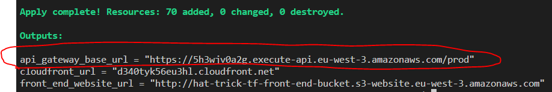

# K6

----------
## Tutorials: How to K6
1) terraform apply the architecture that you want to test and get the backend api address (P3 Example):

1) write a .js script with your tests (you can take a look at the exiting one "tests1_add-clients.js")
2) run the following command inside the /k6_tests directory : 
```
k6 run --vus XX --duration XXs your_script.js --env URL="yourURL"
```
Replace XX by positives integers, your_script.js by the script that you want to use and yourURL with the backend-api url (keep the quotes)

vus being "virtual users" (parallels "while true" execution of the script)
durations being the duration of the script being executed in seconds

----------
## Official Documentation
Installation: https://k6.io/docs/get-started/installation/
How to run: https://k6.io/docs/get-started/running-k6/