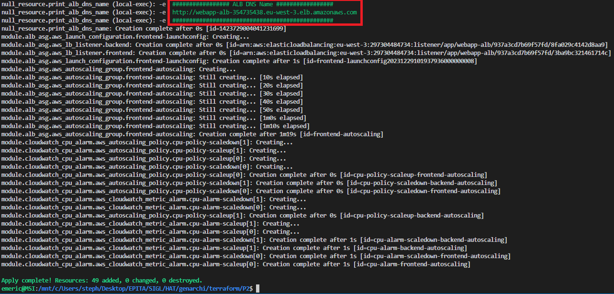
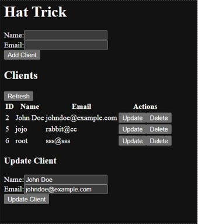

# TERRAFORM - PLATFORM 2

## General informations

Goals:
- Deploy the application on AWS using P2 tools
- The app must be highly available (multi AZ and auto scalling, load ballancer)
- The app must be resilient (Synchronous Replication for the DB)


## PREREQUISITES
Terraform CLI 1.2.0+ installed
AWS CLI intalled
AWS Accound and credentials

Authenticate the Terraform AWS provider with
```
export AWS_ACCESS_KEY_ID=
```

and set the secret key with:
```
export AWS_SECRET_ACCESS_KEY=
```

## Run the project
Run:
```
terraform init
terraform apply
```

You may find the URL of the ALB DNS when terraform applied changes:



## Usage

Enter the ALB DNS url in your web browser to use the application:



You can:
- add clients
- remove clients
- update clients
