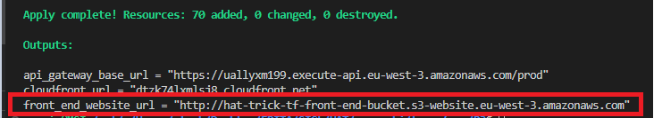

# TERRAFORM - PLATFORM 3

## General informations

Goals:
- Deploy the application on AWS using P3 tools
- The app must be highly available (multi AZ and auto scalling, load ballancer)
- The app must be resilient (Synchronous Replication for the DB)

## PREREQUISITES
Terraform CLI 1.2.0+ installed
AWS CLI intalled
AWS Accound and credentials

Authenticate the Terraform AWS provider with
```
export AWS_ACCESS_KEY_ID=
```

and set the secret key with:
```
export AWS_SECRET_ACCESS_KEY=
```

## Run the project
Run from P3 folder:
```
terraform init
terraform apply
```

You may find the app URL when terraform applied changes:



## Usage

Enter the app URL in your web browser to use the application:


You can:
- add clients
- remove clients
- update clients

------------------------------------------------------------------------------
# DOC FOR DEVS
## SETUP LAMBDA

3 Steps :

- 1. Create a DynamoDB db, with table name "clients"
- 2. Create a Lambda, "node.18" with correct role and copy paste the lambda func
  - 2.A Use iam specific role for lambda
- 3. Call the lamdba in API Gateway, test and deploy
     - 3.A Input passthrough
       `Input passthrough: When there are no templates defined (recommended)`

## CURL examples :

/health

```
 curl -X GET https://26ywp15fia.execute-api.eu-west-3.amazonaws.com/prod/health
```

/add-client

```
curl -X POST https://26ywp15fia.execute-api.eu-west-3.amazonaws.com/prod/add-client -H "Content-Type: application/json" -d '{
  "name": "Joe",
  "email": "joe@epita.fr"
}'
```

/get-clients

```
curl -X GET https://26ywp15fia.execute-api.eu-west-3.amazonaws.com/prod/get-clients
```

/update-client

```
curl -X PUT https://26ywp15fia.execute-api.eu-west-3.amazonaws.com/prod/update-client -H "Content-Type: application/json" -d '{
  "id": "11d43f3b-a1b9-414c-989a-2e7f961478d5",
  "name": "Updated Name",
  "email": "updated-email@example.com"
}'
```

/delete-client

```
curl -X DELETE https://26ywp15fia.execute-api.eu-west-3.amazonaws.com/prod/delete-client -H "Content-Type: application/json" -d '{
  "id": "11d43f3b-a1b9-414c-989a-2e7f961478d5"
}'
```

## Doc :

For foreign key, we use crypto UUID to get a unique value for each item in the table (builtin js package)

https://stackoverflow.com/questions/37072341/how-to-use-auto-increment-for-primary-key-id-in-dynamodb
